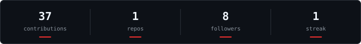

# Nogueira

`Full-Stack Developer`

Trabalho com backend e frontend, principalmente com **JavaScript, TypeScript, Python, Go e PHP**.  
Uso **Linux e terminal** no dia a dia e atualmente estudo **C++, C#, Rust, SQL, Kali Linux e hacking**. Faço parte da **OH Team**.

&nbsp;&nbsp;&nbsp;&nbsp;&nbsp;&nbsp;

### `./stack`

<code>main</code>&nbsp;&nbsp;&nbsp;&nbsp;&nbsp;&nbsp;&nbsp;&nbsp;<code>sys</code>&nbsp;&nbsp;&nbsp;&nbsp;&nbsp;&nbsp;&nbsp;&nbsp;<code>learning</code>&nbsp;&nbsp;&nbsp;&nbsp;&nbsp;<code>hacking</code>

### `./stats`

